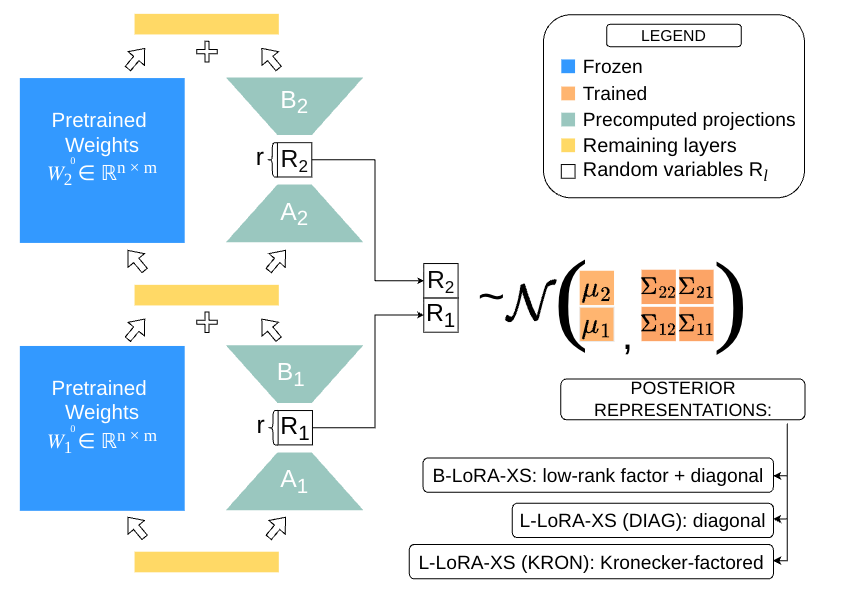

# Bayesian Fine-tuning in Projected Subspaces

Code repository for the paper: [Bayesian Fine-tuning in Projected Subspaces](https://arxiv.org/abs/2605.07706) (Dubovik, Marszałek, Tabor, Kuśmierczyk; 2026).

Our repository is based on [https://github.com/gmum/b-lora-xs](https://github.com/gmum/b-lora-xs) and extends it with Laplace-approximation variants (L-LoRA-XS / L-LoRA-S) and four projection families (SVD, Whitened SVD, DCT, RAND, plus hybrids).



*Figure 1 (paper). Original weights (blue) remain frozen, projections (green) are precomputed from the pretrained weights, and posterior parameters (orange) are learned. Three posterior representations are supported: B-LoRA-XS (low-rank + diagonal), L-LoRA-XS DIAG, and L-LoRA-XS KRON.*

> **Reproducibility.** This repository reproduces the Laplace-variant numbers and projection ablations from the paper. The SWAG-variant numbers (B-LoRA-XS / LoRA-SWAG) are reproduced from [gmum/b-lora-xs](https://github.com/gmum/b-lora-xs).

## Abstract

Low-Rank Adaptation (LoRA) enables parameter-efficient fine-tuning of large models by decomposing weight updates into low-rank matrices, significantly reducing storage and computational overhead. While effective, standard LoRA lacks mechanisms for uncertainty quantification, leading to overconfident and poorly calibrated models. Bayesian variants of LoRA address this limitation, but at the cost of a significantly increased number of trainable parameters, partially offsetting the original efficiency gains. Additionally, these models are harder to train and may suffer from unstable convergence. In this work, we propose a novel framework for parameter-efficient Bayesian fine-tuning, demonstrating that effective uncertainty quantification can be achieved in very low-dimensional parameter spaces. The proposed method achieves strong performance with improved calibration and generalization while maintaining computational efficiency. Our empirical findings show that, with the appropriate projection of the weight space uncertainty can be effectively modeled in a low-dimensional space, and weight covariances exhibit low ranks.

## Methods

This repository implements two posterior approximations on top of LoRA-XS, plus four projection families used to define the low-dimensional adapter subspace.

**Posterior approximations.** Inference is performed only over the LoRA-XS core matrices `R`; the projection bases `A`, `B` are deterministic.

- **L-LoRA-XS** — post-hoc Laplace approximation, `A` and `B` frozen during MAP. Hydra: `method=laplace method.hessian_structure=kron|diag`.
- **L-LoRA-S** — same Laplace approximation, but `A` and `B` are also trained during the MAP phase. Hydra: `method=laplace experiment.unfreeze_A=True experiment.unfreeze_B=True`. For the LLaMA 10M variant from paper §S1-E, additionally set `experiment.extend_target_modules=True` (extends LLaMA target modules with `o_proj`, `down_proj`; the 4M variant uses the default `q_proj`, `v_proj`).
- **B-LoRA-XS** (SWAG variant) — out of scope here; reproduce via [gmum/b-lora-xs](https://github.com/gmum/b-lora-xs).

**Projection families** (selected with `+reconstruction_type=...`):

- `svd` — truncated SVD (default).
- `cca` — Whitened SVD (W-SVD in the paper); see [projections/cca_projections.py](projections/cca_projections.py).
- `dct` — 2D DCT-II with row/column L1-sort permutation.
- `random` — Haar-uniform Gaussian QR (RAND in the paper).
- Hybrids combine bases at fixed fractions, e.g. `dct-1/2_svd`, `cca-1/2_svd`, `random-1/2_svd`, `dct-1/4_svd-1/4_random`. See [projections/hybrid_projections.py](projections/hybrid_projections.py).

## Setup

The canonical dependency spec is [requirements.txt](requirements.txt). Either install
the dependencies directly:

```
python3 -m venv .env
source .env/bin/activate
python -m pip install --upgrade pip setuptools wheel
python -m pip install -r requirements.txt
```

or run the convenience wrapper [scripts/prepare_env.sh](scripts/prepare_env.sh) from
the repository root.

Example environment setup on an HPC cluster is in [scripts/slurm/prepare_env_helios.sbatch](scripts/slurm/prepare_env_helios.sbatch).

Set your workspace directory using `export WORKSPACE_DIR=path`.
Set `save_folder`, `wandb_path` and other Weights & Biases (wandb) settings in [conf/config.yaml](conf/config.yaml). The defaults for `experiment.save_folder`, `experiment.wandb_path`, and `experiment.mnli_model_path` in [conf/config.yaml](conf/config.yaml) are HPC-specific placeholders and must be overridden for your environment.

We use Accelerate and Hydra to run our experiments. Accelerate expects the following variables exported to the working environment:

```
export RANK=0
export LOCAL_RANK=0
export WORLD_SIZE=1
export MASTER_ADDR=localhost
export MASTER_PORT=$((12000 + RANDOM % 20000))
```

We use Weights & Biases (wandb) for monitoring. To log in:

```
pip install wandb weave
wandb login
```

To set it up modify wandb entries in [conf/config.yaml](conf/config.yaml).

To use HuggingFace models one needs to `export HF_TOKEN=...`.
Usage of `meta-llama/Llama-2-7b-chat-hf` requires requesting access.

The easiest is to set all the exports including `WORKSPACE_DIR`, wandb API and HF API key in your `.bashrc`.

Test your environment on a machine with GPU using
[scripts/slurm/run_test_single_gpu.sh](scripts/slurm/run_test_single_gpu.sh).
SLURM scripts assume the job working directory is the repository root, so submit
them from the repo root (`sbatch scripts/slurm/run_test_single_gpu.sh`) or pass
`--chdir=/path/to/bay_loraxs`.

## Data and model weights

Datasets and model weights are downloaded via the helper scripts in `scripts/download/`. Each script honours an environment variable as the default destination, or accepts `--save-dir` directly.

```bash
export BAY_LORAXS_DATA_DIR=/path/to/data
python scripts/download/download_datasets.py --group glue_superglue mcqa

export BAY_LORAXS_MODELS_DIR=/path/to/models
python scripts/download/download_models.py \
    --model roberta-large \
    --model meta-llama/Llama-2-7b-chat-hf
```

- LLaMA-2 requires HuggingFace access and `HF_TOKEN`.
- For RTE and MRPC, the LoRA-XS protocol expects an MNLI-fine-tuned LoRA-XS checkpoint, set via `experiment.mnli_model_path=...`.

## Running experiments

### Running locally with Hydra

A single-GPU run uses `accelerate launch launch_exp_hydra.py` with Hydra overrides. The example below mirrors [experiments/template_roberta_cola.sbatch](experiments/template_roberta_cola.sbatch) and trains RoBERTa-Large on CoLA with the default SVD projection and a Kronecker-factored Laplace posterior:

```bash
accelerate launch launch_exp_hydra.py \
  +reconstruct_config=reconstruct_config.yaml \
  +reconstruction_type=svd \
  model=roberta-large \
  experiment.task=cola \
  experiment.lora_r=8 \
  experiment.lora_alpha=16 \
  experiment.num_epochs=31 \
  experiment.learning_rate=1e-3 \
  experiment.cls_learning_rate=5e-3 \
  method=laplace \
  method.hessian_structure=kron \
  method.do_laplace=True \
  experiment.exp_name=local_roberta_cola_svd
```

To smoke-test the environment on a machine with GPU, run [scripts/slurm/run_test_single_gpu.sh](scripts/slurm/run_test_single_gpu.sh).

### Running on SLURM

LLaMA experiments and grid sweeps are launched via [scripts/slurm/submit_grid.sh](scripts/slurm/submit_grid.sh), which delegates to [scripts/slurm/run_job.sh](scripts/slurm/run_job.sh). RoBERTa templates live in `experiments/template_roberta_*.sbatch`. SLURM scripts assume the job working directory is the repository root, so submit from the repo root (`sbatch scripts/slurm/run_test_single_gpu.sh`) or pass `--chdir=/path/to/bay_loraxs`.

### Reproducing the paper

#### Step 1: Prepare data and models

See [Data and model weights](#data-and-model-weights).

#### Step 2: Launch experiments

- **GLUE / RoBERTa-Large** (CoLA, MRPC, RTE, SST-2): per-task templates in `experiments/template_roberta_{cola,mrpc,rte,sst2}.sbatch`. Grid configs in `experiments/grid_roberta_*_alternative_projections.json` and `experiments/grid_roberta_experiments_baseline_projections.json`. Grids are generated via [experiments/create_experiments.py](experiments/create_experiments.py).
- **MCQA / LLaMA2-7B** (ARC-C, ARC-E, OBQA): per-task templates in `experiments/template_llama_{arc_c,obqa}_loraxs.sbatch`. Grid configs in `experiments/grid_llama_*.json`. Submit via `scripts/slurm/submit_grid.sh`.

#### Step 3: Aggregate and plot results

- `experiments/results_analysis_of_exp_roberta_*.ipynb` — RoBERTa SVD long-run and projection ablation tables.
- `experiments/results_analysis_of_exp_llama_alternative_projections.ipynb` — LLaMA projection ablations.
- [aux_analyses/analysis_of_input_weights_with_dct_projections.ipynb](aux_analyses/analysis_of_input_weights_with_dct_projections.ipynb) — DCT row/column-permutation analysis (paper §IV-C).

Hyperparameter details (SWAG burn-in 10/25, Laplace early-stop checkpoints 10/25 for RoBERTa and end-of-epoch-5/10 for LLaMA, LLaMA α=25, dropout=0, weight decay=0.1, learning rates 1e-3 / 5e-4) are documented in paper §S1.

### Code layout

- LoRA-XS / projection replacement: [loraxs.py](loraxs.py).
- Post-hoc Laplace evaluation: [laplace_utils.py](laplace_utils.py).
- Projections: [projections/](projections/)

## Citation

```bibtex
@misc{dubovik2026bayesianfinetuningprojectedsubspaces,
      title={Bayesian Fine-tuning in Projected Subspaces},
      author={Viktar Dubovik and Patryk Marszałek and Jacek Tabor and Tomasz Kuśmierczyk},
      year={2026},
      eprint={2605.07706},
      archivePrefix={arXiv},
      primaryClass={cs.LG},
      url={https://arxiv.org/abs/2605.07706},
}
```

## License

Copyright (C) 2026 Viktar Dubovik, Patryk Marszałek, Jacek Tabor, Tomasz Kuśmierczyk

This project is distributed under the terms of the [GNU Affero General Public License v3](licenses/LICENSE).
Portions of the code derived from MIT-licensed sources remain compatible under both the MIT license and AGPL v3.
Please see the [SWAG LoRA LICENSE file](licenses/SWAG_LORA_LICENSE) for details.

This program is distributed in the hope that it will be useful, but WITHOUT ANY WARRANTY;
without even the implied warranty of MERCHANTABILITY or FITNESS FOR A PARTICULAR PURPOSE.
See the [GNU Affero General Public License v3](licenses/LICENSE) for more details.